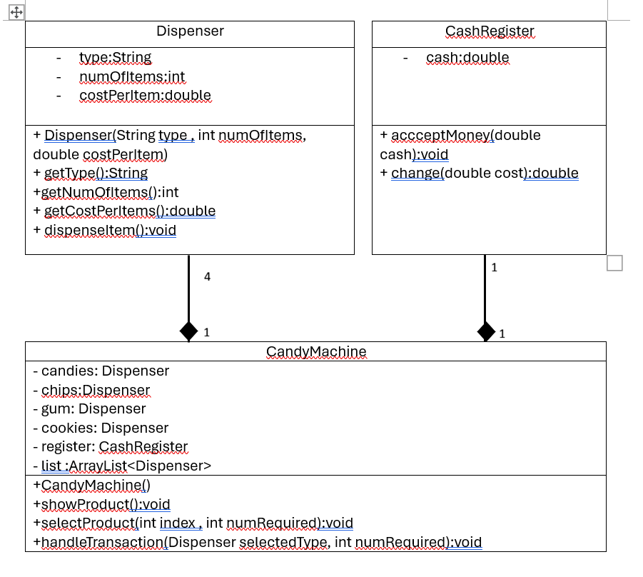

# Tutorial 2 ADTs

## WONG YAN WEN (25005619)


### Question 1

Consider the following problem: 
A new candy machine is purchased for the cafeteria, but it is not working properly. The candy machine has four dispensers to hold and release items sold by the candy machine as well as a cash register. The machine sells four products—candies, chips, gum, and cookies—each stored in a separate dispenser. You have been asked to write a program for this candy machine so that it can be put into operation. 

The program should do the following: 
- Show the customer the different products sold by the candy machine. 
- Let the customer make the selection. 
- Show the customer the cost of the item selected. 
- Accept the money from the customer. 
- Return the change. 
- Release the item, that is, make the sale. 
  
You can see that the program you are about to write is supposed to deal with dispensers and cash registers. That is, the main objects are four dispensers and a cash register.  

Because all the dispensers are of the same type, you need to create a class, say, Dispenser, to create the dispensers. Similarly, you need to create a class, say, CashRegister, to create a cash register. 

You will create the class CandyMachine containing the four dispensers, a cash register, and the 
application program.  

Your tasks are to design ADTs to represent the three classes: 
<br>a. Identify the instance variables for each of the class (i.e. Dispenser, Cash Register, Candy Machine) 

```
Dispenser: private String type;private int numOfItems;private double costPerItem
Cash Register:  private double cash
Candy Machine:  Dispenser candies, chips,gums,cookies ;CashRegister register , ArrayList<Dispenser> list

```

<br>b. Identify the methods/operations for each of the class (i.e. Dispenser, Cash Register, Candy Machine) 

```
Dispenser: 
public Dispenser(String type ,int numOfItems , double costPerItem){}
public String getType(){return this.type;}
public int getNumOfItems(){ return this.numOfItems;}
public double getCostPerItem(){return this.costPerItem;}
public void dispenseItem(int numRequired){}

CashRegister:
public void acceptMoney(double cash){this.cash=cash;}
public double change(double cost){return this.cash-cost;}

CandyMachine:
public CandyMachine(){}
public void showProduct(){}
public void handleTransaction (Dispenser selectedType , int numRequired){}
public void selectProduct(int index,int numRequired){}

```
<br>c. Produce a UML class diagram to represent the three classes




```
public class Dispenser{
    private String type;
    private int numOfItems;
    private double costPerItem;

    public Dispenser(String type ,int numOfItems , double costPerItem){
        this.type = type;
        this.numOfItems=numOfItems;
        this.costPerItem=costPerItem;
    }

    public String getType(){return this.type;}

    public int getNumOfItems(){ return this.numOfItems;}

    public double getCostPerItem(){return this.costPerItem;}

    public void dispenseItem(int numRequired){ 
        if (numRequired<=numOfItems){
            numOfItems-=numRequired;
            System.out.println("Successfully dispensed "+numRequired+" "+this.getType());
        }
    }
}


public class CashRegister{
    private double cash;
    
    public void acceptMoney(double cash){
        this.cash=cash;
    }

    public double change(double cost){
        return this.cash-cost;
    }
}

public class CandyMachine{
    Dispenser candies = new Dispenser("candies",10,1.00);
    Dispenser chips = new Dispenser ("chips",10,2.00);
    Dispenser gum = new Dispenser ("gum",10,0.50);
    Dispenser cookies = new Dispenser("cookies",10,5.00);
    CashRegister register = new CashRegister();
    ArrayList <Dispenser> list = new ArrayList<>();

    public CandyMachine(){
        list.add(candies);
        list.add(chips);
        list.add(gum);
        list.add(cookies);
    }
    

    public void showProduct(){
        for (int i=0;i<list.size();i++){
            System.out.println(i+" "+list.get(i).getType()+"\t"+list.get(i).getCostPerItem());
        }
    }

    public void selectProduct(int index,int numRequired){
        Dispenser selected = list.get(index);
        if (numRequired <selected.getNumOfItems()){
            double totalCost = selected.getCostPerItem()*numRequired;
            System.out.println("Item selected\t: "+selected.getType());
            System.out.println("Quantity\t: "+numRequired);
            System.out.println("Total Cost\t: "+totalCost);

        handleTransaction(selected,numRequired);

        }
    }

    public void handleTransaction (Dispenser selectedType , int numRequired){
        Scanner sc = new Scanner (System.in);
        double payment;
        do{
            System.out.print("Enter amount\t: ");
            payment = sc.nextDouble();
        }while(payment<selectedType.getCostPerItem()*numRequired);
        register.acceptMoney(payment);
        System.out.println("Change\t: "+register.change(selectedType.getCostPerItem()));
        selectedType.dispenseItem(numRequired);
        
    }
    
}
```

### Question 2

A bid for installing an air conditioner consists of the name of the company, a description of the unit, the performance of the unit, the cost of the unit, and the cost of installation. Design an ADT that represents a single bid for installing an air conditioning unit. Write a Java interface named BidInterface to specify the following ADT operations by stating its purpose, precondition, postcondition, parameters using javadoc-style comments: 

- Returns the name of the company making this bid. 
- Returns the description of the air conditioner that this bid is for. 
- Returns the capacity of this bid's AC in tons (1 ton = 12,000 BTU). 
- Returns the seasonal efficiency of this bid's AC (SEER). 
- Returns the cost of this bid's AC. 
- Returns the cost of installing this bid's AC. 
- Returns the yearly cost of operating this bid's AC.

```

public interface BidInterface {

    /*
    example of instance variables in Bid
    private String name ;               name of the company, 
    private double seer;                seer value
    private double performanceTons ;    the performance of the unit (Tons)
    private double performanceBTU       the performance of the unit (BTU)
    private double UnitCost;            the cost of the unit, 
    private double InstallationCost;    the cost of installation.
    */

    //@return the name of the company making this bid. 
    public String getName();
    //@return the description of the air conditioner that this bid is for. 
    public String getDescription();

    //@return the capacity of this bid's AC in tons (1 ton = 12,000 BTU).
    //@postcondition Returns capacity where 1 ton = 12,000 BTU.
    public double getCapacityTons();
    
    /*
    @return the seasonal efficiency of this bid's AC (SEER)
    */
    public double getSEER();
    
    /* 
    @return the cost of this bid's AC. 
    @precondition installationCost and UnitCost must be intialized and positive
    @postconditiomn returns value of bid cost = installationCost + UnitCost
    */
    public double getBidCost();

    //@return the cost of installing this bid's AC. 
    public double getInstallationCost();

    //@return the cost of a unit of AC
    public double getUnitCost();

    /* 
    @return the yearly cost of operating this bid's AC.
    @precondition seer and capacityBTU must be initialized and positive
    @param hourPerDay (hours of usage per day )
    @param daysPerTYear (number of days in use per year) 
    @postcondition returns the value of yearlyCost = (capacityBTU*hoursPerYear*CostPerkWh)/(seer*1000)
    */
    public double getYearlyCost(int hoursPerDay , int daysPerYear);
}
```

Then design another ADT to represent a collection of bids. The second ADT should include methods to search for bids based on price and performance. Also note that a single company could make multiple bids, each with a different unit. Write a Java interface named BidCollectionInterface to specify the following ADT operations by stating its purpose, precondition, postcondition, parameters using javadoc-style comments:

- Adds a bid to this collection. 
- Returns the bid in this collection with the best yearly cost.   
- Returns the bid in this collection with the best initial cost. The initial cost will be defined 
as the unit cost plus the installation cost. 
- Clears all of the items from this collection. 
- Gets the number of items in this collection.  
- Sees whether this collection is empty. 

```

public interface BidCollectionInterface {
    /**
     * Adds a bid to this collection.
     * @param newBid
     * @param 
     * @postcondition the collection size increase by one
    */
    public void addBid (BidInterface newBid);

    /**
    * @return  the bid in this collection with the best yearly cost. 
    * @precondition yearlyCost for every Bid object is calculated
    * @precondition collection must possessed one or more Bid object
    * @params hoursPerDay (hours of usage per day)
    * @params daysPerYear (days of usage per year)
    * @postcondition returns bid with bid cost lowest numerical value of bid cost
    */
    public BidInterface bestYearlyCost(int hoursPerDay, int daysPerYear);

    /**
     * @return the bid in this collection with the best initial cost. The initial cost will be defined 
as the unit cost plus the installation cost. 
     * @precondition unitCost and installation cost in initialized and positive
     * @postcondition  returns Bid object with the lowest numerical value for yearly cost
     */
    public BidInterface bestInitialCost();

    /**
     * Clears all of the items from this collection.
     * @precondition collection is not empty
     * @postcondition collection is fully empty
     */
    public void clearCollection();

    /**
     * @return the number of items in this collection.  
     */
    public int numberOfItems();

    /**
     *  Sees whether this collection is empty
     * @return boolean value , true if empty , false if not empty
     */
    public boolean collectionIsEmpty();
    
}   

```