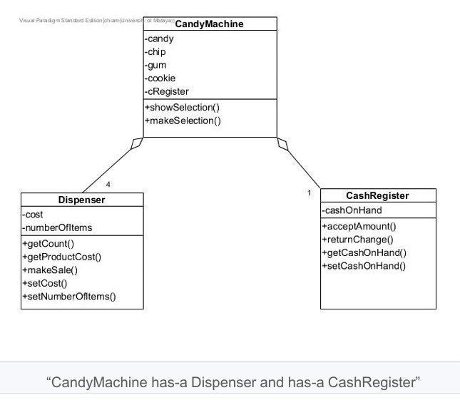

# Tutorial 3 ADTs

## WONG YAN WEN (25005619)


### Question 1

Consider the following problem: 
A new candy machine is purchased for the cafeteria, but it is not working properly. The candy machine has four dispensers to hold and release items sold by the candy machine as well as a cash register. The machine sells four products—candies, chips, gum, and cookies—each stored in a separate dispenser. You have been asked to write a program for this candy machine so that it can be put into operation. 

The program should do the following: 
- Show the customer the different products sold by the candy machine. 
- Let the customer make the selection. 
- Show the customer the cost of the item selected. 
- Accept the money from the customer. 
- Return the change. 
- Release the item, that is, make the sale. 
  
You can see that the program you are about to write is supposed to deal with dispensers and cash registers. That is, the main objects are four dispensers and a cash register.  

Because all the dispensers are of the same type, you need to create a class, say, Dispenser, to create the dispensers. Similarly, you need to create a class, say, CashRegister, to create a cash register. 

You will create the class CandyMachine containing the four dispensers, a cash register, and the 
application program.  

Your tasks are to design ADTs to represent the three classes: 
<br>a. Identify the instance variables for each of the class (i.e. Dispenser, Cash Register, Candy Machine) 

```
Dispenser: private int numOfItems;private double costPerItem
Cash Register:  private double cashOnHand
Candy Machine:  Dispenser candy, chips,gums,cookies ;CashRegister cRegister

```

<br>b. Identify the methods/operations for each of the class (i.e. Dispenser, Cash Register, Candy Machine) 

```
Dispenser: 
public int getCount(){}
public void setNumberIfItems(int numberOfItems){}
public void setCost(double costPerItem){}
public double getProductCost(){}
public void makeSale(int numRequired){}

CashRegister:
public void acceptAmount(double cash){}
public double returnChange(double cost){}
public double getCashOnHand (){}
public void setCashOnHand(double cashOnHand){}

CandyMachine:
public void showSelection(){}
public void makeSelection(int index,int numRequired){}

//handleTransaction is not inside answer given
public void handleTransaction (Dispenser selectedType , int numRequired){}
```
<br>c. Produce a UML class diagram to represent the three classes

Answer:


Sample Answer: 



### Question 2

A bid for installing an air conditioner consists of the name of the company, a description of the unit, the performance of the unit, the cost of the unit, and the cost of installation. Design an ADT that represents a single bid for installing an air conditioning unit. Write a Java interface named BidInterface to specify the following ADT operations by stating its purpose, precondition, postcondition, parameters using javadoc-style comments: 

- Returns the name of the company making this bid. 
- Returns the description of the air conditioner that this bid is for. 
- Returns the capacity of this bid's AC in tons (1 ton = 12,000 BTU). 
- Returns the seasonal efficiency of this bid's AC (SEER). 
- Returns the cost of this bid's AC. 
- Returns the cost of installing this bid's AC. 
- Returns the yearly cost of operating this bid's AC.

```

public interface BidInterface {
    /*
        This is an interface for a single bid for installing an air conditioning
    */
    
    /**
        Return the name of this company making this bid.
        @precondition none.
        @postcondition the name was returned.
        @return the name of the company making this bid. 
    */
    public String getName();


    /** 
        Returns the desctiption of the air conditioner that this bid is for.
        @precondition none.
        @postcondition The description was returned.
        @return the description of the air conditioner 
    */
    public String getDescription();

    /**
        Returns the capacity of this bid's AC in tons (1 ton =12000 BTU)
        @precondition none
        @postcondition the performance was returned .
        @return the cooling capacity of the AC unit in tons
    */
    public double getCapacityTons();
    
    /**
        Returns the seasonal efficiency of this bid's AC (SEER)
        @precondition none
        @postcondition the performance was returned
        @return the efficiency of the AC unit.
    */
    public double getSEER();
    
    /**
        Returns the cost of installing this bid's AC.
        @precondition none
        @postcondition the installation cost was returned.
        @return the cost of installing this bid's AC in dollars. 
    */
    public double getInstallationCost();

    /**
    
        Returns the cost of the bid's AC.
        @precondition none
        @postcondition The AC cost was returned.
        @return the cost of a unit of AC in dollars.
    */
    public double getUnitCost();

    /**
        Return the yearly cost of operating this bid's AC. 
        @precondition none
        @postcondition the yearly cost was returned. 
        @param hoursOperated the number of hours the unit operates per year.
        @param energyCost Cost in dollars per kilowatt hour.
        @return The cost for the year in dollars,
        cost -12*tons*energyCost*hoursOperated/SEER

    */
    public double getYearlyCost(int hoursOperated , double energyCost);

}//end BidInterface
```

Then design another ADT to represent a collection of bids. The second ADT should include methods to search for bids based on price and performance. Also note that a single company could make multiple bids, each with a different unit. Write a Java interface named BidCollectionInterface to specify the following ADT operations by stating its purpose, precondition, postcondition, parameters using javadoc-style comments:

- Adds a bid to this collection. 
- Returns the bid in this collection with the best yearly cost.   
- Returns the bid in this collection with the best initial cost. The initial cost will be defined 
as the unit cost plus the installation cost. 
- Clears all of the items from this collection. 
- Gets the number of items in this collection.  
- Sees whether this collection is empty. 

```

public interface BidCollectionInterface {
    /**
     * Adds a bid to this collection.
     * @precondition none
     * @postcondition the bid was added at the end of the collection. 
     * @param newBid The bid to be added.
     * @postcondition the collection size increase by one
    */
    public void addBid (BidInterface newBid);

    /**
    * Return the bid in this collection with the best yearly cost.
    * @precondition The collection is not empty.
    * @postcondition the bid with the lowest yearly cost was returned.
    * @param averageHours Average hours of operation per year
    * @param energyCost Cost in dollars per kilowatt hour.
    * @return a bid with lowest yearly cost.
    */
    public BidInterface bestYearlyCost(double averageHours, double energyCost);

    /**
     * Return the bid in this collection with the best initial cost. The initial cost will be defined as the unit cost plus the installation cost.  
     * @precondition the collection is not empty.
     * @postcondition the bid with the lowest initial cost was returned
     * @return the bid with lowest initial cost.
     */
    public BidInterface bestInitialCost();

    /**
     * Clears all of the items from this collection.
     * @precondition none
     * @postcondition collection is fully empty
     */
    public void clearCollection();

    /**
     * return the number of items in this collection.
     * @precondition none
     * postcondition returns the number of items in the collection
     * @return the collection is unchanged  
     */
    public int getNumberOfItems();

    /**
     * Sees whether this collection is empty
     * @precondition none
     * @postcondition the collection is unchanged
     * @return true if there are no items in the bid collection , false otherwise.
     */
    public boolean collectionIsEmpty();
    
}   //end BidCollection
```
