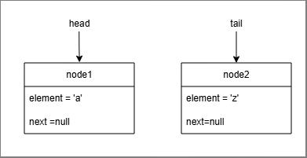
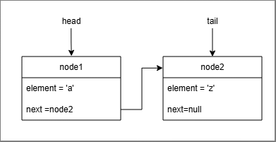
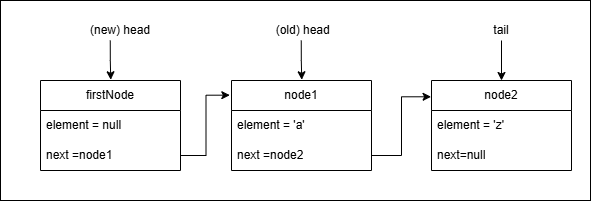
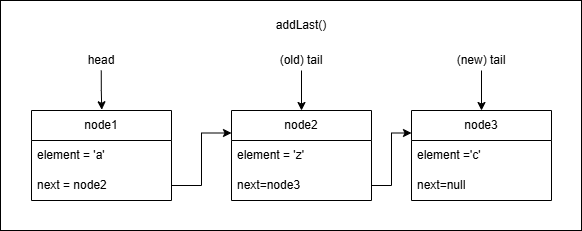
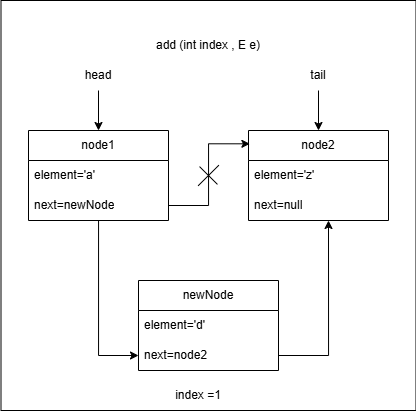
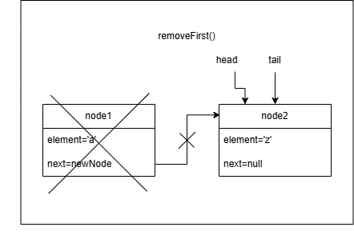
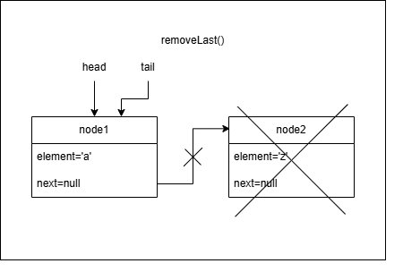
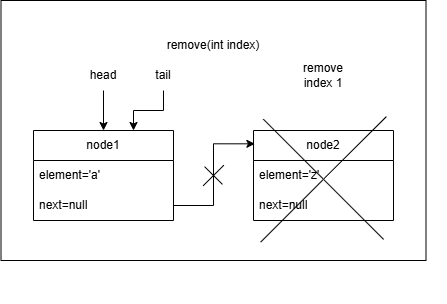
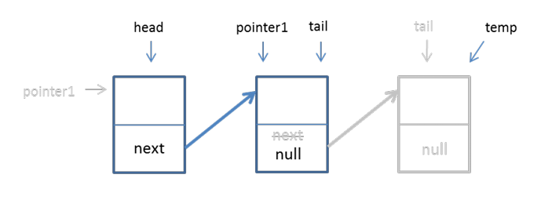

# Tutorial 4 Linked List 

## WONG YAN WEN (25005619)

### Question 1:

a) Assume that a node class called Node<E> exist. Create two nodes called node1 and node2. Node1 contains alphabet ‘a’ and node2 contains alphabet ‘z’. Also, create 2 references, head and tail. Let head points to node 1 and tail points to node 2.

```
Node<Character> node1 = new Node <> ('a');
Node <Character> node2 = new Node <> ('z');

Node<Character> head = node1;
Node <Character> tail= node2;
```

b) Draw the nodes from (a).



c) Write a statement/code for node1 accessing the node2. Modify 1(b) to show this. 

```
node1.next=node2;
```



d) Create a new node, firstNode. Add this new node at the first location of all existing nodes. Draw these nodes.  



e) If we have no information about the status of a linked-list, what are the conditions we need to consider to perform the operation in (d)?

```
- whether the linkedList is empty or not
```

f) Write a list of operations/steps/pseudocode needed to add the firstNode to the first location.

```
-Create a new node named firstNode
-Create a pointer to the current head
-New node created & assigned to new head
-Increase size of list by one
-If the tail is null (if no node existed before this)
    -Assign head as the tail
 End if
```

g) Write codes to assign the firstNode to the first location.

```
public void addFirst(E e){
    Node<E> firstNode = new Node <> (e); 
    firstNode.next=head;
    head = fistNode;
    size++;
    if (tail==null){
        tail=head;
    }
}
```

h) Repeat (d) – (f), for the following operations :

i.addLast() – value of element, c



Condition:
```
If no node exist 
```

Pseudocode:
```
if no node exist 
    Create a new node and assign it to head and tail
else
    Create a pointer to the newly created node
    Assign new node to tail

Increase size by one
```

Code:
```
public void addLast(E e){
    if (tail==null){
        head=tail=new Node<>(e);
    }else{
        tail.next=new Node<>(e);
        tail=tail.next;
    }
    size++;
}
```

ii.add(int index, E e) – value of element, d




Condition:
```
-if no node existed 
-if index is equal to zero
-if index is greater than or equal to size of list
```

Pseudocode:
```
If index is equal to zero
    create and add new Node to the first index
else if index is greater than or equal to size of list
    create and add new Node to last index
else 
    create a current and assign temporary value of head
    for (int i=0;i<index;i++)
        assign next node to the current node
    
    Create a Node temp and assign next node after current
    Replace the next Node of current with a new Node
    Assign next , next value of new current to be temp
    Increase size by one
    
```

Code:

```
public void add (int index, E e){
    if (index==0){addFirst(e);}
    else if (index>=size){addLast(e);}
    else {
        Node <E> current = head;
        for(int i=0;i<index;i++){
            current=current.next;
        }
        Node <E> temp= current.next;
        current.next= new Node <E> (e);
        (current.next).next= temp;
        size++;
    }
}
```

iii.removeFirst() 



Condition:
```
-if no node in the list
-if head is null 
```

Pseudocode:
```
if size of list is zero
    return null
else 
   Copy head to temp node before delete
   set new head
   reduce size by one

   if head is null 
        Assign tail as null
    
    return the deleted item,temp;
```


Code:
```
public E removeFirst(){
    if (size == 0) return null; 
    else{
        Node <E> temp = head;
        head= head.next;
        size--;
        if (head==null) tail=null;
    }
    return temp.element;        
}
```

iv.removeLast()



Condition:
```
- if there is no node
- if there is only one node
```

Pseudocode:
```
if list is empty
    return null
else if list only has one node
    Create a node temp and a pointer to head
    Set head and tail to null
    reset size of list to zero
    return temp item
else
    Create a node current and pointer to head
    for (int i=0;i<size-2;i++){
        //Stop one node before tail
        Set next node to current node
    }
    Create a node temp and pointer to tail
    Set current as tail
    Set next value of tail to be null
    Reduce size of list by one
    return temp item
    
```

Code:
```
public E removeLast(){
    if (size==0) return null;
    else if (size==1){
        Node <E> temp = head;
        head=tail=null;
        size=0;
        return temp.element;
    }
    else{
        Node <E> current = head;
        for (int i=0;i<size-2;i++){
            current=current.next;
        }
        Node <E> temp = tail;
        tail = current;
        tail.next=null;
        size--;
        return temp.element;
    }
}
```

v.remove(int index) – remove at index 1



Condition:
```
- if index is less than 0
- if index is greater than or equal to size
- if index is zero
- if index is size-1
```

Pseudocode:
```
if index is out of bounds (index<0 or index >-size)
    return null
else if index is 0
    return removeFirst();
else if index is size-1
    return removeLast();
else
    Create a node previous and set head to be previous
    for (int i=1;i<index;i++){
        //stop before index to be deleted
        set next value to be previous
    }
    Create node current and copy previous.next to current
    Set new point to from previous.next to current.next
    Reduce size by one
    return current item;
```

Code:
```
public E remove(int index){
    if (index<0 || index>=size) return null;
    else if (index==0) return removeFirst();
    else if (index==size-1) return removeLast();
    else {
        Node <E> previous = previous.next;
        for (int i=0;i<index;i++){
            previous = previous.next;
        }
        Node <E> current = previous.next;
        previous.next=current.next;
        size--;
        return current.element ;
    }

}

```

### Question 2:
Given is a method containing incorrect statements that checks if an element is in a list.

```
public void operationX(E e) {     
    pointerB.next = pointerB;
       for(int i++; i>size; int i) {
         System.out.println(current.element);
           if(current.element = e) 
       }       
    
    Node<E> pointerB = head;
    return false;
}
```
a) What is the name of the method for operationX?

```
contains()
```

b) Correct the statements by rewriting them in the correct order and syntax.Write the correct/right method name to replace operationX.

```
public boolean contains(E e) {     
    Node <E> current = head;
    for(int i=0; i<size; i++) {
        if ((current.element).equals(e)){
            System.out.println(current.element);
            return true;
       }       
        current = current.next;
    }
    return false;
}
```

### Question 3: 
Given the following nodes. Answer the following:



a) Based on the above figure, what is the name of the method for above operation?

```
removeLast()
```

b) Write codes to represent the above figure. (Kindly use the variables stated in the figure)

```
public E removeLast(){
    if (size==0) return null;
    else if (size==1){
        Node <E> temp = head;
        head=tail=null;
        size=0;
        return temp.element;
    }
    else{
        Node <E> pointer1 = head;
        for (int i=0;i<size-2;i++){
            pointer1=pointer1.next;
        }
        Node <E> temp = tail;
        tail = pointer1;
        tail.next=null;
        size--;
        return temp.element;
    }
}
```


