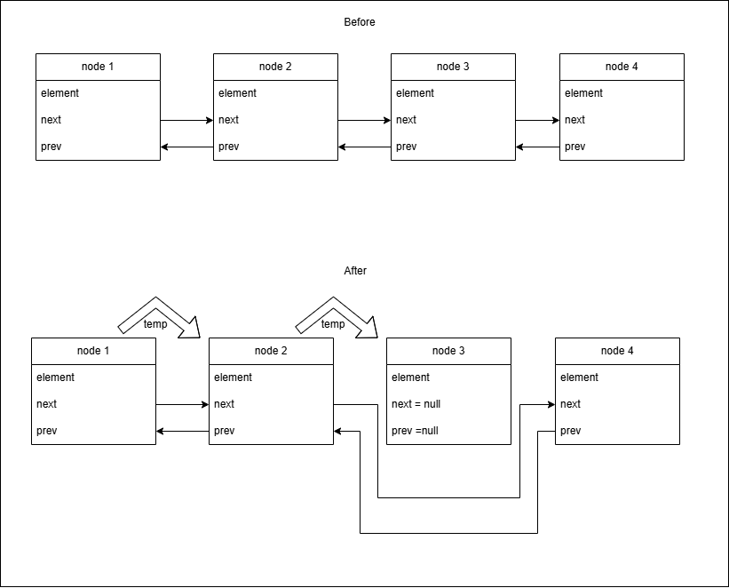
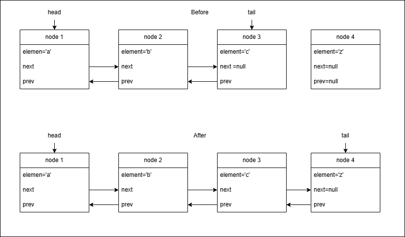

# Tutorial 5 Linked List & Double Linked List 

## WONG YAN WEN (25005619)

### Question 1:

```
1   public E xyz(int index,E e)
2   {
3       Node<E> current=head;
4       Node<E> temp;
5            if(index<0) return null;
6            else if(index>=size-1) {
7                this.addLast(e);
8                return null;
9           }
10            else if(index==0) {
11                temp=head;
12                head.element=e;
13                return temp.element;
14            }else{
15                for (int i = 1; i < index; i++) {
16                    current=current.next;
17                }
18                temp=current.next;
19                current.next.element=e;
20                return temp.element;
21           }
    }
```

Given method xyz with 2 arguments:

a) Based on the above source code, explain what the lines of code do from line 10 – 21.

```
The method xyz purpose is to add a node at a specific index. 

From line 10 to 13 , the code is handling a situation where the index argument received is 0 . When index is 0, the new node is added to the first index.

From line 14-21, the code is handlimg a situation where the index argument is any number within 0 - size of list. The code will set a node temp as head , traverse through the entire list until it reaches the node with the index argument. Then that node is stored in the current node . The new node is added to the index of the current node. The new node next value is set to be the current node.
```

b) What is the main purpose of the method xyz()?

```
The method xyz purpose is to add a node at a specific index. 
```

c) Obviously, there are some bugs in the source code. Debug the code and make it concise and simpler.

```
1   public void xyz(int index,E e)
2   {
3       Node<E> current=head;
4       Node<E> temp;
             // CHANGE RETURN NULL TO INDEXOUTOFBOUNDS
5            if(index<0) throw IndexOutOfBoundsException ();//
6            else if(index>=size-1) {
7                this.addLast(e);
8           //REMOVE RETURN STEP
9           }
10            else if(index==0) {
11                this.addFirst(e)
13                //REMOVE RETURN STEP
14            }else{
                  Node <E> current = head;
15                for (int i = 1; i < index; i++) {//change > to <
16                    current=current.next;
17                }
18                Node <E >temp=current.next;//STORE THE ORIGINAL NEXT VALUE IN TEMP 
19                current.next = new Node <E> (e);
                  (current.next).next = temp;   //CREATE NEW LINK FROM NEW NODE TO TEMP
20                //REMOVE RETURN STEP
21           }
    }
```

### Question 2:

```
1   else{
2       Node<E> temp = head;
3       for(int i=0; i<index; i++){
4           temp = temp.next;
5       }
6       element = temp.element;
7       temp.next.prev = temp.prev;
8       temp.prev.next = temp.next;
9       temp.next = null;
10      temp.prev = null;
11      size --;
12  }
```

Based on the source code above, assume the index given is 3

a) Explain what the lines of code do from line 2-11.
```
The code is a part of a remove(int index) method in DoublyLinkedList.

At line 2 , a temp Node is and is assigned a temporary value of head. This temp node is the node to be deleted.
At line 3 to 5 , the code traverse through the list until it reaches the given index (in this case , 3). The code will loop 2 times and temp is assigned node2.next.
At line 6 , the temp element is stored in a variable called element.

From line 7 to 8 , new link is created to skip over the deleted node.
At line 7 ,the code is assigning node 2 .next with node 4 .
At line 8 , the code is assigning node 4 . prev with node 2.

From line 9 to 10 , old link is deleted . So , temp.next and temp.prev is null.
Finally , size of list will decrease by one.
```

b) Draw the nodes for lines 7 - 10



### Question 3

A doubly linked list keeps a set of characters. The head, the middle and the tail nodes respectively contains alphabet ‘a’, ‘b’ and ‘c’. These nodes are in successive order. Create a new node that contains alphabet ‘z’. Add this new node at the last location of this linked list. Draw all of these nodes including their correct references.




