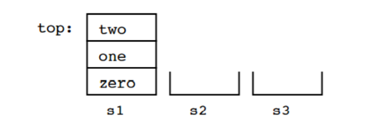
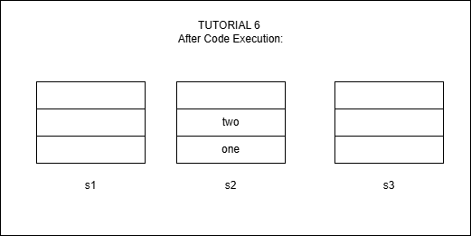

# Tutorial 6 Stack & Problem Solving with Stacks

## WONG YAN WEN (25005619)

### Question 1:

The stack method that returns an element from the stack without removing it is ____________. 

a. pop

b. push

c. peek 

d. spy

```
ANSWER: c. peek
```

### Question 2: 

We have three stacks, s1, s2 and s3, that can contain data of type String. Here are their initial contents:



As you can see, initially s2 and s3 are empty. Here is a sequence of operations on the three stacks:

```
s2.push(s1.pop()); 
s3.push(s1.pop()); 
s1.pop(); 
s1.push(s2.pop()); 
s2.push(s3.pop()); 
s2.push(s1.pop()); 
```

Draw the contents of the three stacks after the operations are complete.



### Question 3: 

Over time, the elements 1, 2, and 3 are pushed onto a stack in that order. For each of the following, indicate (yes or no) whether the sequence could be created by popping operations. If yes, list the sequence of push() and pop() operations that produces the sequence.

(a) 1-2-3

(b) 2-3-1

(c) 3-2-1

(d) 1-3-2

```
FIXED ANSWER :
(a) 1-2-3   yes

push 1, pop 1
push 2, pop 2
push 3, pop 3

(b) 2-3-1   yes

push 1, push 2, pop 2
push 3, pop 3
pop 1

(c) 3-2-1   yes

push 1, push 2, push 3
pop 3, pop 2, pop 1

(d) 1-3-2   yes

push 1, pop 1
push 2, push 3
pop 3, pop 2
```

**Reminder:
Because pushes and pops can be interleaved, several different pop orders are possible.
A stack only forbids removing a lower item while a later item is still on top of it.**

### Question 4: 

Convert the following infix expressions to postfix: 

a) a + b * c 

```
ANSWER: 
a+bc*
a b c * +
```

b) a * b – c/d 

```
ANSWER:
ab * -c/d
ab * - cd /
ab * cd / -
```

c) a + (b*c + d)/e

```
FIXED ANSWER:
a + (b*c + d)/e
a + bc * d + /e
a + bc * d + e /
a bc * d + e / +

```
****REMINDER****
- () FIRST
- \* AND / BEFORE + AND -
- IN POSTFIX , OPERATORS APPEAR AFTER THEIR OPERANDS


### Question 5: 

Write the following expressions in infix form: 

a) a b + c * 

```
ANSWER: 
(a+b)*c
```

b) a b c + * 

```
ANSWER: 
a * (b + c)
```

### Question 6: 

Which of the following is an application of stack? 

A. finding factorial 

B. tower of Hanoi 

C. infix to postfix 

D. all of the above

```
ANSWER: D. all of the above
```