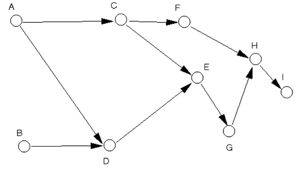

# Tutorial 8 Graph

## WONG YAN WEN (25005619)

### Question 1:
Write an adjacency matrix and an adjacency list for the following graph.


ANSWER:


```
ADJACENCY MATRIX

    A   B   C   D   E   F   G   H   I
A  {0   0   1   1   0   0   0   0   0}
B  {0   0   0   1   0   0   0   0   0}
C  {0   0   0   0   1   1   0   0   0}
D  {0   0   0   0   1   0   0   0   0}
E  {0   0   0   0   0   0   1   0   0}
F  {0   0   0   0   0   0   0   1   0}
G  {0   0   0   0   0   0   0   1   0}
H  {0   0   0   0   0   0   0   0   1}
I  {0   0   0   0   0   0   0   0   0}


ADJACENCY LIST
Node List:
A   CD
B   D
C   FE
D   E
E   G
F   H
G   H
H   I
I      
```


### Question 2:
Represent the graph in question 1 using a 2 dimensional array. You use the adjacency matrix or the adjacency list for this purpose?

ANSWER:

```
int [][] adjacency matrix = {
  {0, 0, 1, 1, 0, 0, 0, 0, 0}   //A
  {0, 0, 0, 1, 0, 0, 0, 0, 0}   //B
  {0, 0, 0, 0, 1, 1, 0, 0, 0}   //C
  {0, 0, 0, 0, 1, 0, 0, 0, 0}   //D
  {0, 0, 0, 0, 0, 0, 1, 0, 0}   //E
  {0, 0, 0, 0, 0, 0, 0, 1, 0}   //F
  {0, 0, 0, 0, 0, 0, 0, 1, 0}   //G
  {0, 0, 0, 0, 0, 0, 0, 0, 1}   //H
  {0, 0, 0, 0, 0, 0, 0, 0, 0}   //I
};

Use adjacency matrix.
```

### Question 3:
Write code to create the graph using linked-list representation. You use the adjacency matrix or the adjacency list for this purpose?

ANSWER:

```
Note: 
↓  reference to next vertex
→  reference to next edge

A →  C → D
↓   
B →  D
↓ 
C →  F → E
↓ 
D →  E
↓ 
E →  G
↓ 
F →  H
↓
G →  H
↓ 
H →  I
↓ 
I 

Use Adjacency list.
```

