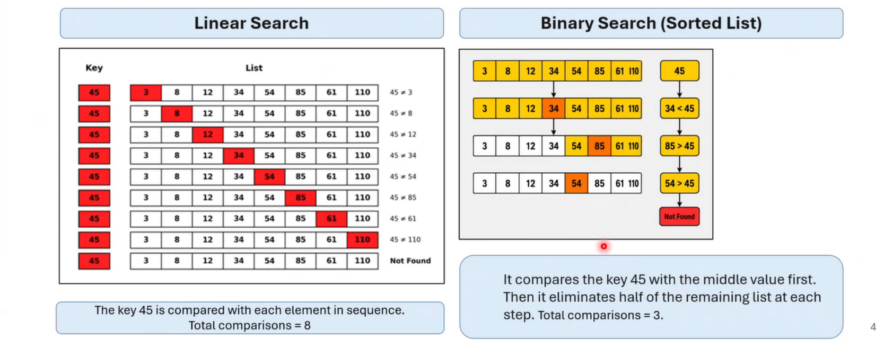
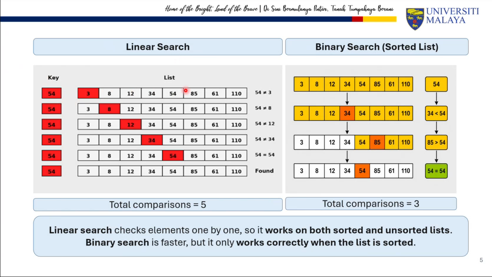
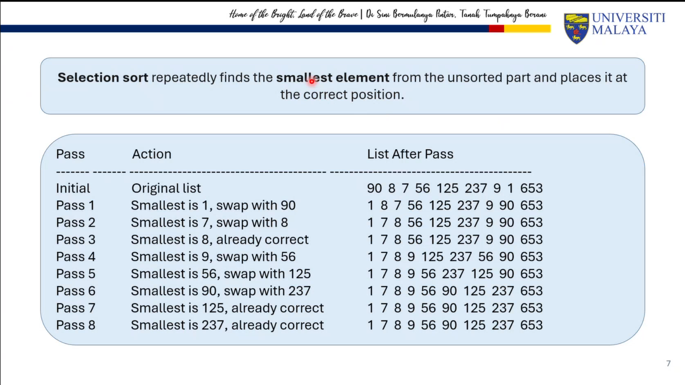
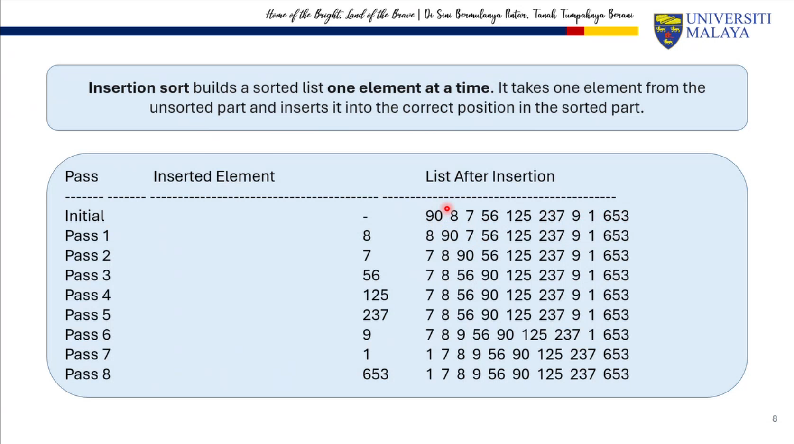
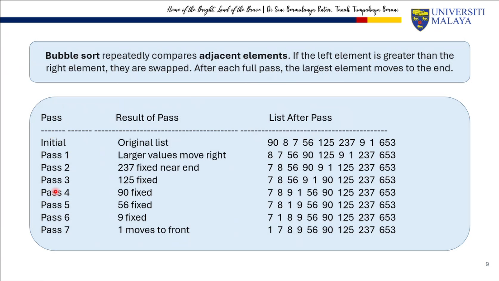
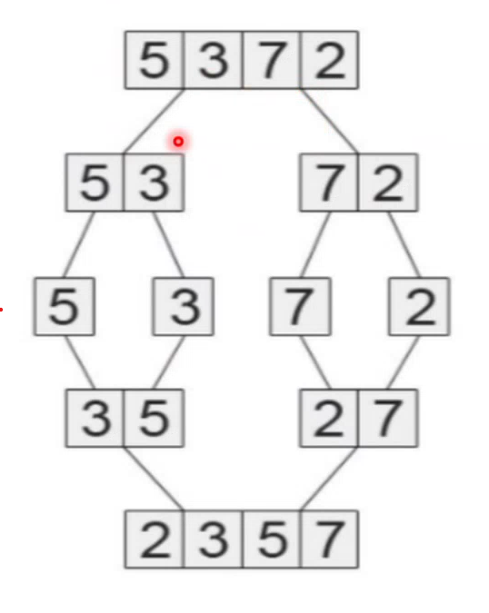
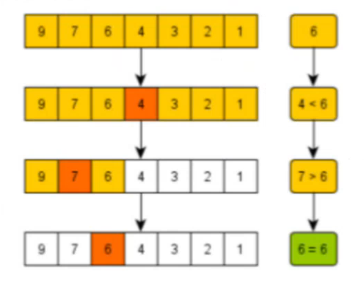
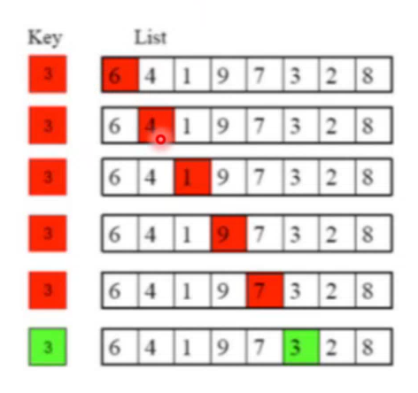

# Tutorial 10 Sorting and Searching

## WONG YAN WEN (25005619)

### Question 1:
Compare between linear search and binary search algorithms by searching for the number 45 and 54 in the following list:

**3   8   12  34  54  85  64  61  110**

SAMPLE ANSWER: 





### Question 2: 
Describe the technique for each sort algorithm below. Given the following list:

**90    8   7   56  125 237 9   1   653**

Show a trace execution for :
<br>a. Selection sort
<br>b. Insertion sort
<br>c. Bubble sort
<br>d. Merge sort

SAMPLE ANSWER:

a. Selection sort



b. Insertion sort



c. Bubble Sort



d. Merge sort


### Question 3: 
Which type of sort algorithm is this?



SAMPLE ANSWER: 

```
Merge sort 

Why?
The diagram shows divide-and-conquer:
split → sort sublists → merge.
split:[5,3,7,2] becomes [5,3] and [7,2]
then sort: [3,5] and [2,7]
then merge: [2,3,5,7]
```

### Question 4: 
Which type of search algorithm is this?



SAMPLE ANSWER:

```
Binary search

Why?
It compares the key 6 with the middle value first.
Then it eliminates half of the remaining list at each step.
The comparisons shown are: 4<6, then 7>6, then 6=6.
```

### Question 5:
Which type of search algorithm is this?



SAMPLE ANSWER: 

```
Linear Search

Why?
The key 3 is compared with each element in sequence: 
6,4,1,9,7,3
No halves are discarded, and the scan moves item by item.
The search stops when 3 is found.
```

