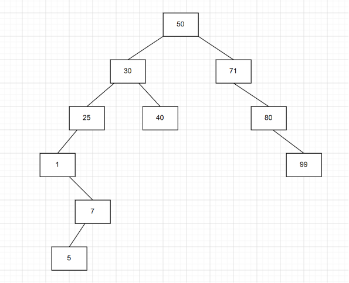
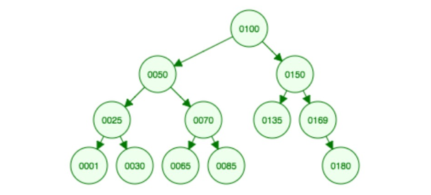
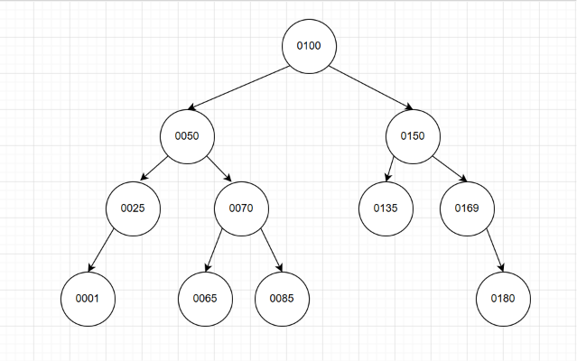
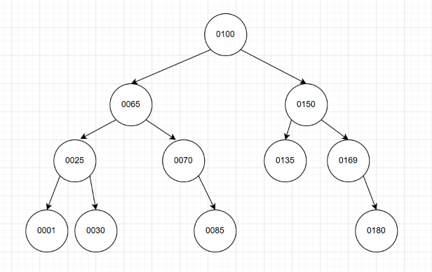
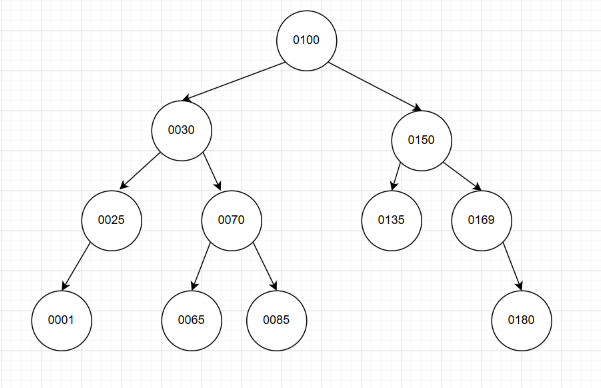

# Tutorial 11 Binary Search Tree

## WONG YAN WEN (25005619)

### Question 1:
What is a binary search tree (BST)?

ANSWER:

A binary search tree (with no duplicate elements) has the property that for every node in the tree the value of any node in its left subtree is less than the value of the node and the value of any node in its right subtree is greater than the value of the node.

### Question 2:
Build a BST based on the input 50, 30, 25, 71, 80, 99, 40, 1, 7, 5. Draw the final tree.

ANSWER: 



### Question 3:
What is the height of the tree built in Question 2?

ANSWER: 5

### Question 4:
Given the following BST, list the items in the order of:



(a) Pre-order traversal (explore left,self, right)

ANSWER:

```
0100
0050
0025
0001
0030
0070
0065
0085
0150
0135
0169
0180
```

(b) In-Order traversal 

ANSWER:

```
0001
0025
0030
0050
0065
0070
0085
0100
0135
0150
0169
0180
```

note to self: 
- traverse the node like normal
- print the node that is reached the 2nd time
- suitable to print ascending order
<br>

(c) Post-order traversal (left,right,self)

ANSWER:

```
0001
0030
0025
0065
0085
0070
0050
0135
0180
0169
0150
0100
```

note to self: 
- traverse the node like normal
- print the node that is reached the 3rd time
<br>

### Question 5:
Using the same BST in Question 4, delete the element `0030’. Draw the resulting tree.

ANSWER:



### Question 6:
Again, using the same BST in Question 4 (i.e., ignoring the deletion of '0030' in Question 5), delete the element '0050'. Draw the resulting tree.

ANSWER 1(use smallest value in right subtree):



ANSWER 2 (use largest value in left subtree):



